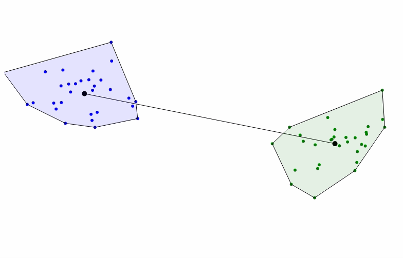

# Jeremy Teitelbaum

[UConn Homepage with publications, etc.](https://teitelbaum.math.uconn.edu)

### Work:

- [Cleverly Titled Blog](https://jeremy9959.github.io/Blog) on data science, beginning with my sabbatical at
[The Jackson Laboratory for Genomic Medicine](http:/www.jax.org) during Academic Year 2018-2019.
- [Talks](https://github.uconn.edu/pages/jet08013/Talks/)
- [Clustering Seminar, Fall, 2019](http://jeremy9959.net/Clustering-Seminar)

### Teaching:
- [Transition to Higher Mathematics](https://jeremy9959.net/Math-2710-Fall-2019), UConn, Fall, 2019
- [Mathematical Aspects of Machine Learning](https://jeremy9959.net/Math-5800-Spring-2020), Course, UConn, Spring 2020.

### Machine Learning Visualization and related Projects:

- [Browse tSNE clustering of 5000 fashion-MNIST images](https://tsne-fashion.herokuapp.com) -- hosted externally so takes
a little time to start.
- [Bokeh Theme Builder](https://bokehthemebuilder.herokuapp.com) -- a tool to build themes for the plotting package [bokeh](http://bokeh.pydata.org).
- [Polya's Urn](https://polyas-urn.herokuapp.com)
- [Disassembling a Bokeh Model](./structure_graph.html) -- [bokeh](http://bokeh.pydata.org) is a visualization
library that I've gotten quite interested in.  This is the output of a tool that shows the structure of
a bokeh plot interactively.
- [Bokeh, Bokehjs, and Observablehq](https://towardsdatascience.com/bokeh-bokehjs-and-observablehq-6ddf0c5ffe8a)
- [Visualizing the SVM problem](https://observablehq.com/@jeremy9959/svm) - a work in progress using [d3.js](https://d3js.org) and [Observable](https://observablehq.com).
- The image at the top of this page shows the SMO algorithm finding the closest points in two linearly separable convex sets.  

**Contact info:** 
Monteith Hall 231 
Department of Mathematics 
University of Connecticut 
Storrs, CT 06269 
(currently working from home) 
 

email: firstname.lastname at uconn.edu 
