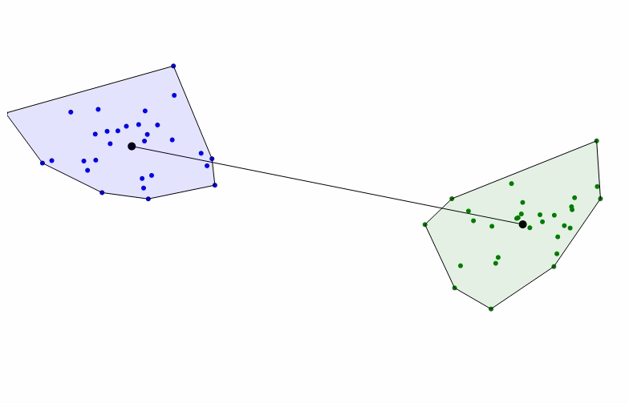

# Jeremy Teitelbaum

[UConn Homepage with publications, etc.](https://teitelbaum.math.uconn.edu)

### Work

- [Lectures (and Videos) on topics in Machine Learning](ML.html)

### Teaching

During Fall of 2026, I will be teaching:

- [Linear Algebra, Math 5250](https://jeremy9959/net/Math-5250-UConn)
- [Transition to Advanced Mathematics, Math 2710W](https://jeremy9959.net/Math-2710-UConn). These course notes follow [The Book of Proof](https://www.people.vcu.edu/~rhammack/BookOfProof/) and include video lectures covering nearly the entire book. 

### Course Materials

- [Abstract Algebra](https://jeremy9959.net/2021-Fall-3230-Math) Materials for the Intro to Abstract Algebra Course at UConn. Based on [Judson's Abstract Algebra](http://abstract.ups.edu/) book. Videos and Notes.
- [Algebra I (Math 5210)](https://jeremy9959.net/Math-5210-UConn)
- [Algebra II (Math 5211)](https://jeremy9959.net/Math-5211-UConn)

### Machine Learning Visualization and related Projects:

- [Row Reduction (JS)](./rref.html) -- Not machine learning, but useful for linear algebra class. A javascript step-by-step row reduction tool for pedagogical purposes.
- [Wallpaper Groups](https://observablehq.com/@jeremy9959/the-plane-symmetry-groups/2) -- visualization of the 17 plane symmetry groups

### Fun

- [It's Hard to Be Funny as Dean](ItsHardToBeFunnyAsDean.md) -- a song written during my stint as Dean of CLAS at UConn.
- [I am the very model of a Provost Acadmical](https://www.youtube.com/watch?v=xn_P-lxrju8) -- a pastiche composed in honor of Peter Nicholls's retirement as Provost from UConn.

### Banjo

I'm a student of clawhammer and two-finger style old-time banjo. Some videos of my playing are available on [my youtube channel](https://www.youtube.com/channel/UCA1BW10SyK-G2AJlajKY99w). Here is a two-finger arrangement of New Five Cent
I wrote as an "assignment" by my teacher [Matt Brown](https://twofingerbanjo.com).

[Here is the tool I wrote to help with writing this sort of tablature using lilypond](https://jeremy9959.net/BanjoTab).

<!---

--->

**Contact info:** 
Monteith Hall 231 
Department of Mathematics 
University of Connecticut 
Storrs, CT 06269 
 

email: firstname.lastname at uconn.edu 
